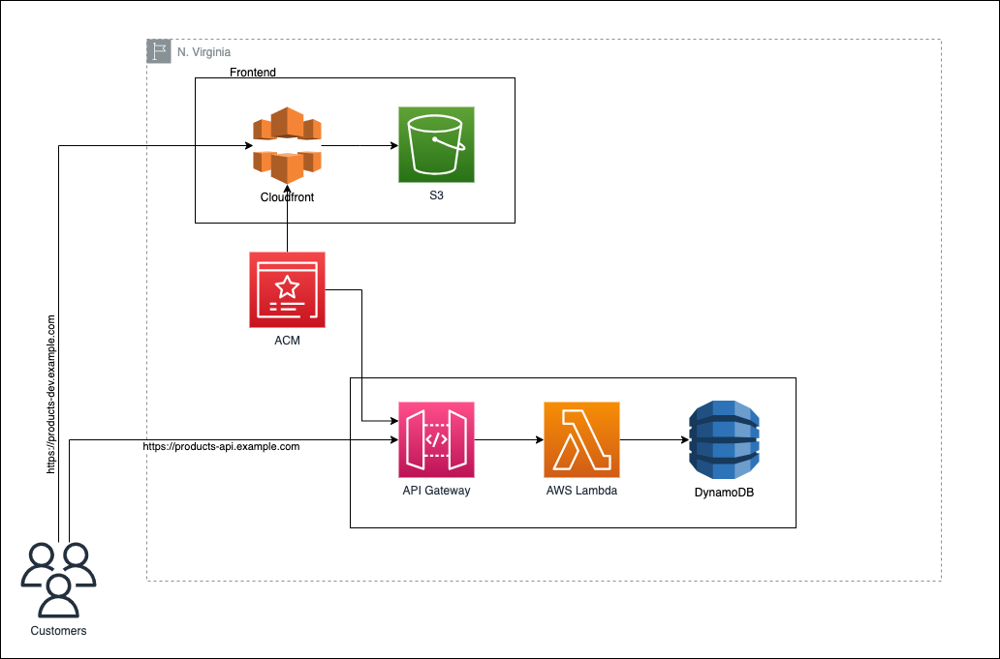

# Hadiya Products Serverless

In this POC project we are going to deploy an Angular and NodeJS application to AWS Serverless environment.

## Architecture



## Dev stuff you need to know

### Versions

- Backend => Express (Node 16.x +)
- Frontend => Angular (Node 16.x +)
- Database => AWS DynamoDB

### Database

- 1 AWS DynamoDB Table with "id" having type "String" as primary key.
- Refer the .env.development file for details.. You dont need to worry about port number.. it's for local testing only.
- Execute the seeder script to seed your DynamoDB table with data as follows:
```bash
# For seeding to dev table
npm run seed
```

### Backend

- Create .env file similar to .env.development, and specify the variables according to the enviroment.
- Run the application by:
```bash
# Run Locally/Development for testing
npm run dev
# Run for production
npm run prod
```

### Frontend

- Change the files src/environments/environment.ts & src/environments/environment.prod.ts with right backend URL for dev & prod respectively.
- Serving the application:
```bash
# Serve development mode
npm run start
# Serve production mode
npm run start-prod
```
- Build the application:
```bash
# Development build
npm run build
# Production build
npm run build-prod
```

## Note

**YOU ARE HERE FOR DevOps POC. I believe that's all you need from a developer. Use your head from here on.**

#### ALL THE BEST !!!